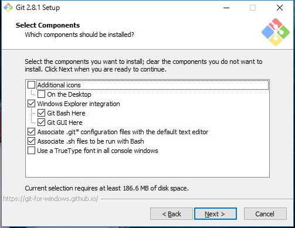
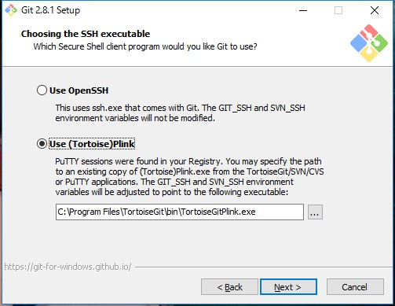
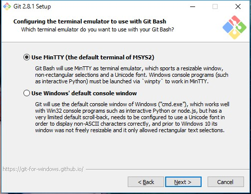
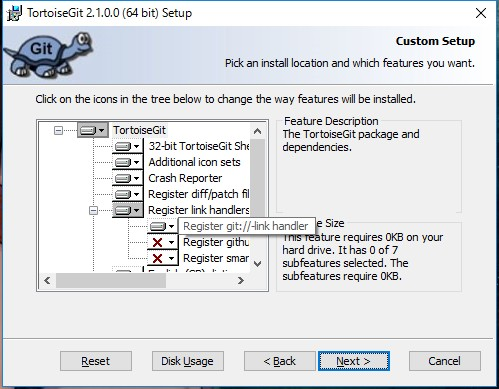

# Required Tools
## Linux
Check if the required packages are existing:
- git: `git --version`
- OpenSSH: `ssh -V`

## Windows 10
- [Git for Windows](https://git-scm.com/download/win)
- [TortoiseGit](https://tortoisegit.org/download/)
- * Note that __TortoiseGit__ is different from __TortoiseSVN__, and the developers who previously install TortoiseSVN are suggested to install TortoiseGit separately.

# Installation
## Ubuntu
- git:
```
sudo apt-get update
sudo apt-get install git
```
- OpenSSH client:
```
sudo apt install openssh-client
```

## Windows 10
- git:

 
Features to be installed

 
Git command-line setup

 
Use OpenSSH is recommanded in many tutorial, but it is tested to cause error on Windows 10, so that Tortoise Plink is used instead.

 
Tested working

 
Recommanded

 
Left as default

- tortoiseGit:
 
Register for git 
