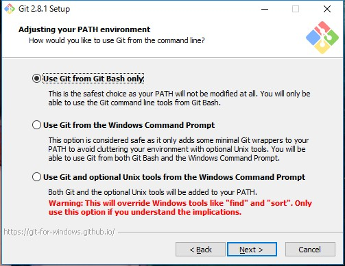
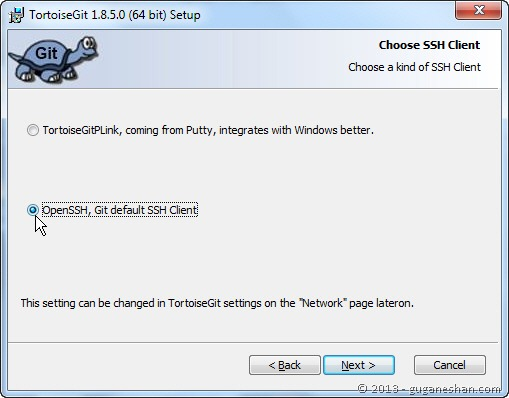

# Git and GitLab Guideline  
## Table of Contents
1. [Required Tools](#required-tools)  
2. [Installation](#installation)  
3. [Configuration](#configuration)  
    3-1. [git config](#git-config)  
    3-2. [ssh key](#ssh-key)  
    3-3. [Gitlab Account](#gitlab-account)  
4. [Repository](#repository) 
    5-1. [Repository Creation](#repository-creation)  
    5-2. [Update Remote](#update-remote)  
    5-3. [Update Local](#update-local)  
    5-4. [Other Operations](#other-operations)  
5. [References](#references)  


## Required Tools
### Linux
Check if the required packages are existing:

- Git: `$ git --version`  
- OpenSSH: `$ ssh -V`

### Windows 10
- [Git for Windows](https://git-scm.com/download/win)
- [TortoiseGit](https://tortoisegit.org/download/)  
    ***Note that __TortoiseGit__ is different from __TortoiseSVN__.***  
    Developers who previously install TortoiseSVN should install TortoiseGit separately.

## Installation
### Ubuntu
- Git:  
``` sh
$ sudo apt-get update
$ sudo apt-get install git
```
- OpenSSH client:  
``` sh
$ sudo apt install openssh-client
```

### Windows 10
- Git:  
    -  Features to be installed  
      
  
    - Git command-line setup  
      
  
    - Use __OpenSSH__ is recommended in many tutorial, but it is tested to cause error on Windows 10, so that __Tortoise Plink__ is used instead.  
      
  
    - Tested working  
      
  
    - Recommanded  
      
  
    - Left as default  
      

- TortoiseGit:
    - Register for git   
      
  
    - Unlike showing in the picture, choose __TortoiseGitPLink__, which is better for Windows:  
      
  
## Configuration
### git config  
For __Linux__, use those commands on terminal;  
For __Windows__, those can be applied on Git Bash:
``` sh
$ git config --global user.name "Your Name"
$ git config --global user.email "email@example.com"
```
The config info is stored in _$HOME/.gitconfig_:  
```
[user]
	email = example@email.com
	name = username
```
The location of $HOME/.gitconfig:  
- For Linux: ```~/.giconfig``` or ```/home/your-username/.gitconfig```
- For Windows: ```C:/Users/Your-Username/.gitconfig```  
  
### ssh key  
For __Linux__ and __Git Bash__ on Windows:  
##### Generating the key:  
```$ ssh-keygen -t rsa -C "a-title-your-can-remember"```  
  
The default location to save the ssh key: ```$HOME/.ssh/id_rsa```  
  
##### Catching the key:  
```$ cat ~/.ssh/id_rsa.pub```  
  
##### To add:  
```$ ssh-add ~/.ssh/id_rsa```  
  
For *Windows* user, since __TortoiseGit__ is being used, there is a different way to add ssh key:  
  
1. From [start] menu, run [PuTTYgen]:    
  
2. If you have not generated a key using __Git Bash__, you can [generate] it now:  
  
  
3. If you already have a key, you can now [load] the key (default path: ```$HOME/.ssh/id_rsa```)  
  
4. Click [Save private key], save it as .ppk file:  
  
5. In your project repository, right click and navigate to  [__TortoiseGit__] => [Settings]   
  
6. Navigate to [Git] => [Remote], choose a name from [Remote]. for the field __Putty Key__, browse the folder of your ssh keys, and open the .ppk file your want:  
  
    
##### GitLab Account  
1. Catch the ssh key on __terminal__ or __Git Bash__ and copy, or copy it from __PuTTYgen__:  
```$ cat ~/.ssh/id_rsa.pub```  
  
  
2. Login to your __GitLab__ account, navigate to [Profile Settings], go to [SSH Keys] tab, past to [key] area; if the format is correct, the [Title] should be automatically generated:  
  

## Repository  
remote: __ssh__ and __https__  
  
  
branch: __master__  
  
### Creat Repository  
Clone: ```$ git clone [url] (directory)```  
Init:  
```
$ git init
$ git remote add origin [url]
```  
### Update Repository  
```
$ git status    # check changes
$ git add [file(s) separated by whitespace] # add file to commit
$ git commit -m "message"   # save the changes locally
$ git pull (origin) (master)    # update from remote
$ git checkout -b [branch-name] # for developers and lower
$ git push (origin) (master)    # update from local
```  
### Other Operations  
Resolve conflicts: manually  
```$ git diff   # find the conflicts```
  
Remote modification:  
```
$ git remote rename [old-remote] [new-remote]    # renaming
$ git remote remove [remote-name]    #remove
```  
  
Protected branch:  
Push directly: __Master__ and higher  
Push to a new branch and send merge request: __Developer__ and lower  
  
## References  
#### Git and TortoiseGit: [Step by Step](http://guganeshan.com/blog/setting-up-git-and-tortoisegit-with-bitbucket-step-by-step.html)  
#### Tutorial in Chinese: [liaoxuefeng](http://www.liaoxuefeng.com/wiki/0013739516305929606dd18361248578c67b8067c8c017b000)  
#### Markdown: [Markdown | Markdown | Help | GitLab](https://blue.cse.buffalo.edu/gitlab/help/markdown/markdown.md)  

